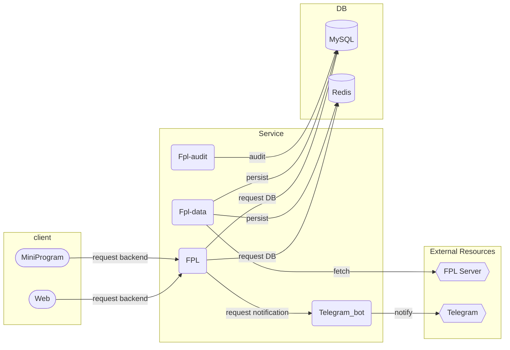
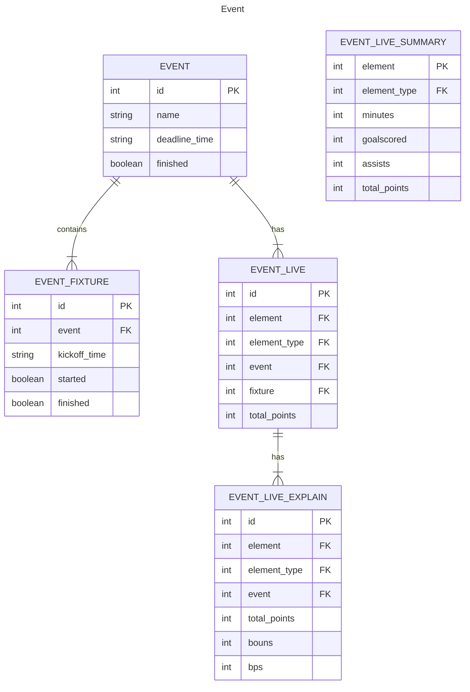
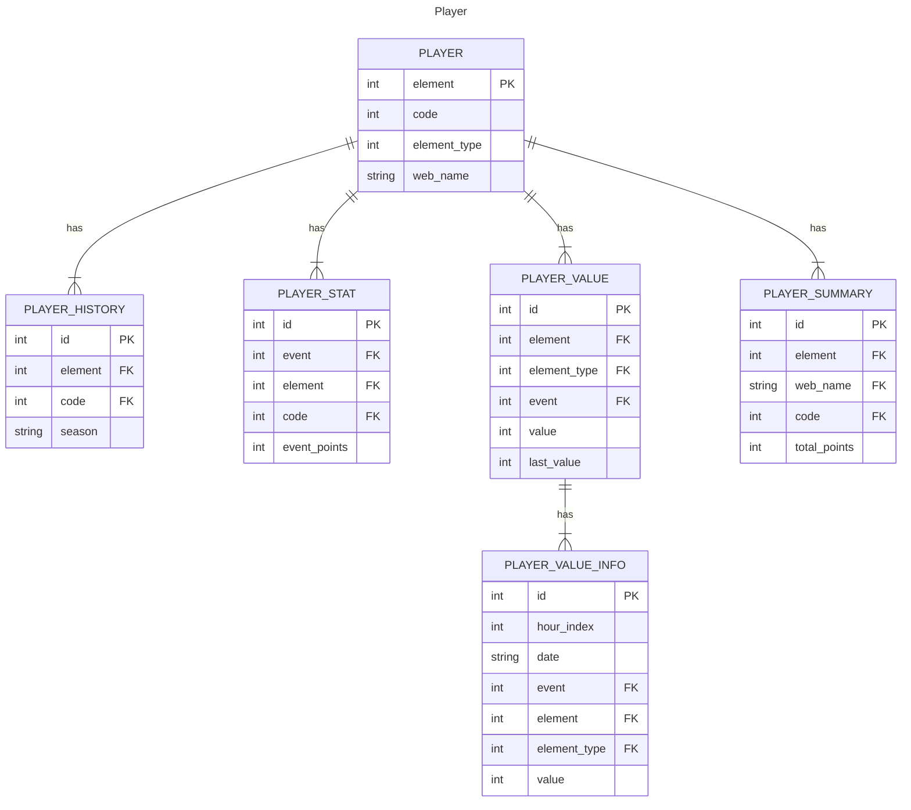
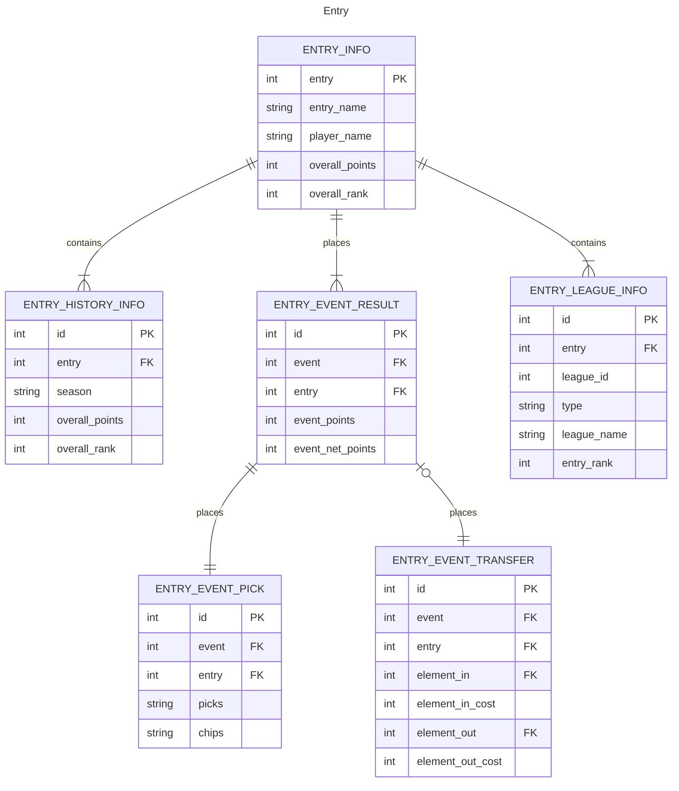
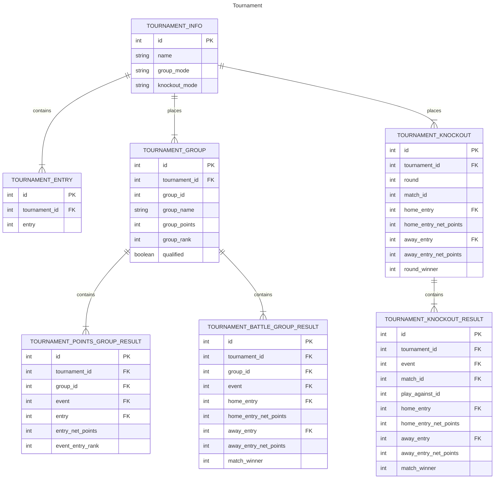
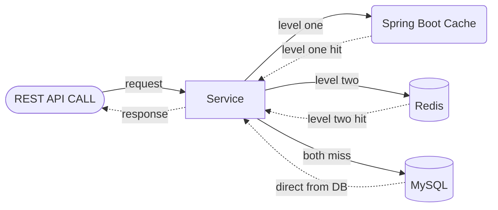
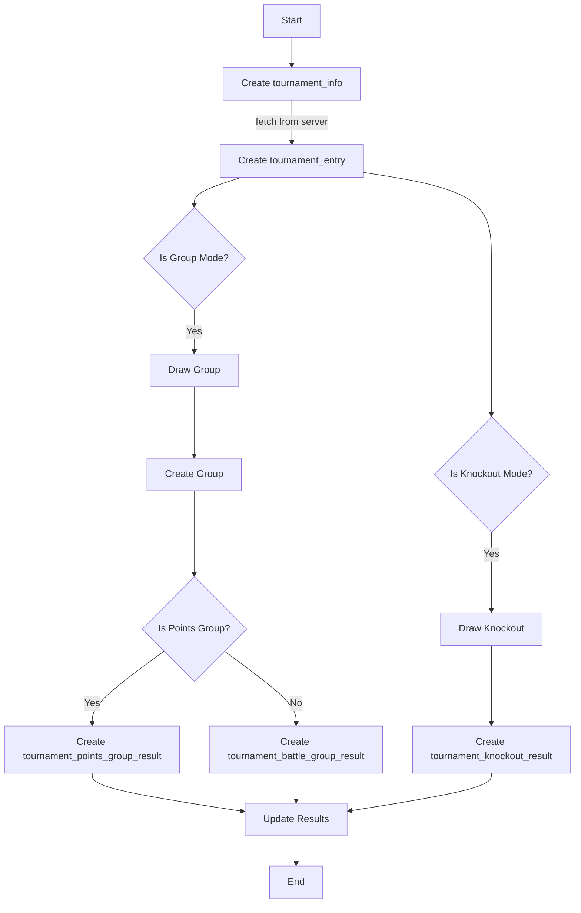
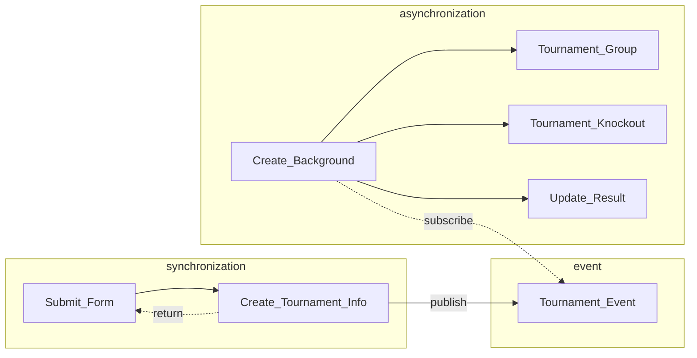
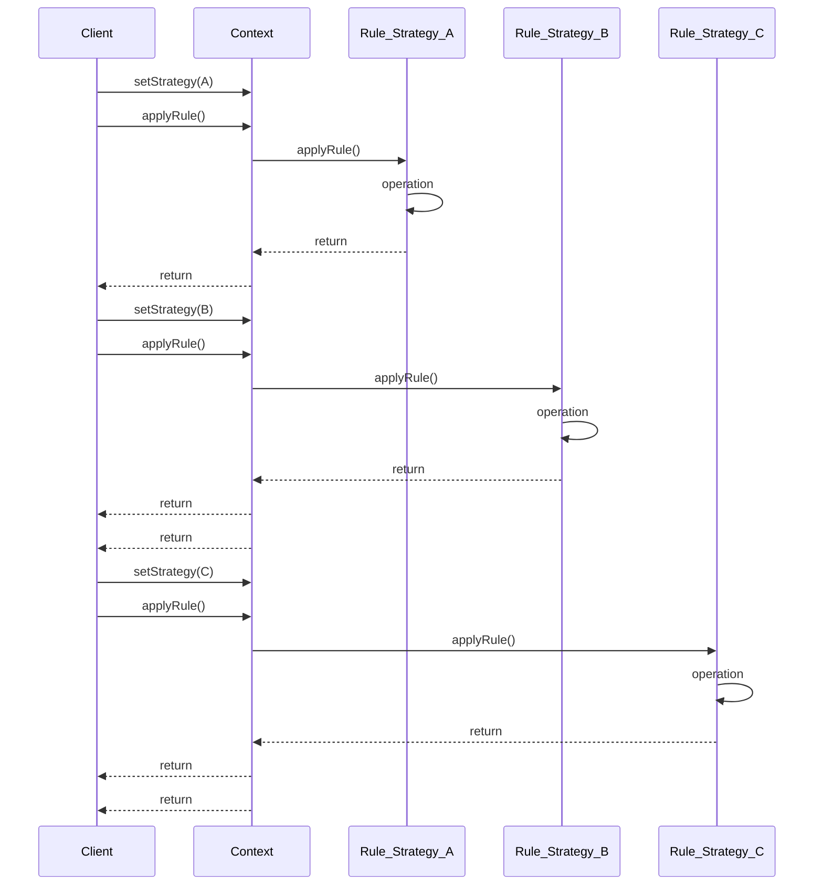

# Overall

FPL is the primary repository of the LetLetMe projects, a personal project designed for managing and analyzing Fantasy Premier League (FPL) data, providing tools and services to FPL players.

This project started as a combined frontend and backend initiative but evolved into multiple projects, each focusing on a specific aspect of the system. 
Initially, the frontend and backend were not separated, and later, the backend was further divided into multiple projects, catering to services for clients, data processing, and notifications. 
The system architecture is shown in the following diagram.

FPL utilises Spring Boot as the backend framework, with all services provide to external systems implemented as REST APIs. 
It operates efficiently within the Java ecosystem, offering ease of maintenance and scalability.

# Tech Stack

## Backend


- **[Java 20](https://www.java.com/en/)** + **[Spring Boot 3](https://spring.io/projects/spring-boot)**


- **[MySQL](https://www.mysql.com/)** for data storage


- **[Redis](https://redis.io/)** for caching


- **[Maven](https://maven.apache.org/)** for build and dependency management


- **[Logback](https://github.com/qos-ch/logback)** for logging


- **[Jasypt](https://github.com/ulisesbocchio/jasypt-spring-boot)** for encryption and decryption of sensitive data


- **[Jenkins](https://www.jenkins.io/)** for CI/CD


- **[Thymeleaf](https://www.thymeleaf.org/)** for server-side template


## Frontend


- **[Layui](https://github.com/layui/layui)** for user interface


- **[Axios](https://axios-http.com/)** for HTTP Client for browser


- HTML5 + JavaScript + CSS3

# LetLetMe Universe Architecture


## Web Service Architecture

### Client Side
There are currently two clients for _LetLetMe_: one is the website, and the other is the WeChat mini-program client, maintained in separate projects: [letletme-web](https://github.com/tonglam/letletme-web) and [miniprogram-letletme](https://github.com/tonglam/miniprogram-letletme).

In the beginning, back in 2020, as it was intended to be a simple toy project, the website was designed as a server-side rendered web application using Thymeleaf as the template engine, implemented with basic HTML, CSS, and JavaScript. 
For UI components, I chose [Layui](https://github.com/layui/layui), fitting my background as a Java backend engineer, which allowed me to build the website quickly with less time spent on learning frontend stuff.

However, as the project grew, the website began to exhibit multiple limitations. 
It was not designed to be responsive, making it unfriendly to mobile users. 
Additionally, as a non-single-page application, the user experience was suboptimal. 
Considering that most of my users are in China, in May 2021, I decided to introduce the WeChat mini-program as the second client, offering a more user-friendly experience for Chinese users, especially on mobile devices (both iOS and Android). 
Afterward, I dedicated most of my time to frontend work on the mini-program client, and the website was not updated frequently.

I had plans to rebuild the website using a modern frontend framework like React or Vue but didn't find enough time to do so. 
Recently, in February 2024, I began using Next.js to rebuild the website in [letletme-web](https://github.com/tonglam/letletme-web), and the project is still in progress. 
The new version of the website will be based on a modern framework, mobile-friendly, and free from the WeChat ecosystem, which has become increasingly sickening for me day by day.
When the new website is ready, I will deprecate the old website in this project and focus on maintaining the new one.

## Service Side
The backend services are divided into four projects: FPL, Fpl-data, Fpl-audit, and Telegram_bot.

### [FPL](https://github.com/tonglam/fpl-public)
[FPL](https://github.com/tonglam/fpl-public) is the core service of _LetLetMe_ universe, providing services to clients. 
After the WeChat mini-program client was introduced, the FPL project focused on backend tasks.
All the REST APIs are implemented in this project. 
Additionally, it provides backend capabilities such as:

- Creating and managing customer tournaments in multiple modes
- Calculating live FPL Points and live FPL League Rankings
- Providing summaries and reports of each user's FPL team
- Offering summaries and reports of user tournament performance
- Providing FPL tools like _price change_, _player stat_, _team selection_, etc.

### [Fpl-data](https://github.com/tonglam/fpl-data-public)
[Fpl-data](https://github.com/tonglam/fpl-data-public) fetches data from the _Fantasy Premier League_ servers, cleans and transforms the data, and then stores it in **MySQL** and **Redis**.

### [Fpl-audit](https://github.com/tonglam/fpl-audit)
As one of the main purposes of _LetLetMe_ is providing FPL data to users, 
it is vital to ensure the data shown on the _LetLetMe_ frontend is exactly the same as users can view from the _FPL official website_.
[Fpl-audit](https://github.com/tonglam/fpl-audit) checks the data from FPL official APIs, as well as those stored in the database. 
When it finds any data mismatches, it updates the data in the database to correct it. 
Basically, it is a corrective mechanism to maintain data consistency.

### [Telegram_bot](https://github.com/tonglam/telegramBot-public)
This is the simplest service in the LetLetMe universe. 
It is a Telegram bot service that sends notifications to users.

# Modules

## REST API
There are two types of **REST APIs** in the project: one for the website and the other for the WeChat mini-program.
The former is provided by the controllers in the `com.tong.fpl.controller` package, 
and the latter is provided by the controllers in the `com.tong.fpl.controller.api` package.

The REST APIs are organized into several modules, including common queries, entry, live, player, tournament, stat, summary, etc.

## DB
**MySQL** serves as the relational database for this project, and the [MyBatis_Plus](https://github.com/baomidou/mybatis-plus) framework is selected to augment the utilisation of **MyBatis** within the project.

The Entity Relationship Diagram (ERD) is shown below to illustrate the relationship between tables designed in the database.









## Caching




This project serves as a provider for a lot of data querying through **REST APIs**, so the caching mechanism is crucial for performance.


For most of the data, I use a two-level caching mechanism, 

with the first level being the in-memory cache provided by **Spring Cache**, and the second level being **Redis**. 

When a query is made, the system first checks the in-memory cache, and if the data is not found, it checks the Redis cache; 

if all the caches are missed, the system queries the database and then stores the data in both the in-memory cache and Redis.


The mechanism protects the database from being overwhelmed by queries and provides a better user experience. 

It is a good practice in the **Java ecosystem** to use a **two-level caching** for frequently queried data.


But remember, some data is **not suitable for caching**, such as live data, which needs to be calculated in real-time. The caching mechanism should be used with caution in such cases.

## AOP and Logging
The usage of AOP in the project is to log the service behaviors without modifying the business logic.

To facilitate better maintenance, the logging in the project is designed to be flexible and user-friendly.
The project utilizes **Logback** as the logging framework and **Slf4j** as the logging facade.
The logback configuration file, *logback-spring.xml*, is located in the resources folder and is tailored for flexibility and ease of use.

Logs are separated into three files:
- *controller.log*: Time-based, rolled daily, used for monitoring the requests and responses of the REST APIs providing for the frontend.
- *api_controller.log*: Time-based, rolled daily, used for monitoring the requests and responses of the REST APIs providing for the WeChat mini-program.
- *interface.log*: Time-based, rolled daily, used for monitoring the requests and responses of the interfaces, specifically HTTP calls between this project and others.
- *fpl.log*: Time-based, rolled daily, used for monitoring the business logic of the project.

# Vital Services Details
This section covers details of some vital services in the project.

## Live Calculation Service
The live calculation is based on two types of data: entries (FPL teams) that need to be calculated and live results of FPL elements (PL players).

### Workflow
Using a tournament as an example
(see `com.tong.fpl.service.ILiveService.calcLivePointsByTournament(int event, int tournamentId)`), 
the live calculation follows the steps below:
1. **Fetch the entry data** from the database or from the _FPL Server_, including the entry's information, such as entry name, player name, event pick, event played chip, and event played captain.
2. **Fetch player information** from the database, such as player's name, team, position, and event fixture.
3. **Fetch the player live data** from the _FPL Server_.
4. **Calculate the predicted bonus points** for each playing match.
5. **Calculate the live points** for each entry, then update the live ranks in this tournament.
6. **Put all the data together** and return it to the frontend for display.

### Challenges
1. The data fetching process is time-consuming, particularly when directly retrieving entries' information from the _FPL Server_. 
Given that one _FPL league_ may contain tens to hundreds of entries, fetching all this information can be time-intensive, leading to delays in subsequent steps.
2. In a single live calculation, where ten to hundreds of entries are involved, the process must handle hundreds to thousands of player data, which also contributes to time consumption.
3. Due to the number of entries, many entries share the same player. 
Fetching player data repeatedly for these entries becomes inefficient and wastes resources.
4. Balancing static data and dynamic data presents a challenge. 
While static data, which remains unchanged during live calculations, can be cached to improve service performance, 
dynamic data cannot be cached in the same manner. 
Finding an optimal balance is crucial for efficient processing.

### Optimisation
1. The initial optimization strategy for this service was somewhat a "cheat." 
Users were asked to set up a tournament before the FPL season began. 
By following this approach, the system could fetch all entries' information from the FPL Server and store it in the database after each event active. 
Compared to fetching from the FPL Server every time, this allowed us to obtain the necessary entry data from the database and even cache it. 
As a result, this approach significantly reduced the time consumption of the entry data fetching process.
2. For a single calculation, we can characterize this task as a CPU-bound task because it involves a substantial amount of computation.
To enhance the performance of this task, the natural solution is to employ multi-threading and parallel computing. 
I utilised the Java `fork/join` framework to implement this solution, and it resulted in a significant reduction in time consumption. 
The `fork/join` framework offers tools to facilitate faster parallel processing by making an effort to utilise all available processor cores. 
It achieves this through a divide-and-conquer approach.
3. The next optimization strategy was to divide the player data into two parts: static data and dynamic data. 
As mentioned in the [Fpl-data](https://github.com/tonglam/fpl-data-public) project, 
there are tasks that run daily to fetch player data from the FPL Server and store it in the database. 
So, we can cache the static data from the DB to improve performance, and all we need is to fetch live player data from the FPL Server in real-time. 
This reduces the complexity of fetching data from making **one HTTP call per player for static data + one HTTP call** for all the living data to just needing to make **one call per live calculation**. 
Certainly, with the reduced number of HTTP calls, the time consumption of the live calculation process was significantly decreased.

### Optimised Workflow
After these optimisations, the live calculation now follows the steps below:

1. **Prepare Static Data:** Fetch the entry data and players' static data from the database.
2. **Parallel Computing:** Fetch the players' live data from the FPL Server and calculate the live points for each entry in parallel.
3. **Calculate** live bonus points and update the live ranks in the tournament.
4. **Return** the data to the frontend for display.


## Tournament Management Service

### Workflow

Creating a tournament involves several steps, including:
1. Create tournament information, which includes basic details such as name, group mode, and knockout mode.
2. Fetch all the entries' information from the FPL Server and store it in the tournament_entry table.
3. According to the submitted form, choose to create a group tournament or knockout tournament or both. 
4. For a group tournament, create groups, draw group positions, and create tournament_points_group_result or tournament_battle_group_result to store the group results for every gameweek.
5. For a knockout tournament, create knockout rounds, draw the knockout matches, and create tournament_knockout_result to store the knockout results for every gameweek.
6. Update all the results for every gameweek in the tournament.


### Challenge and Solution



Tasks in the background, such as fetching entries' information from the FPL Server, drawing groups or knockout matches, and updating tournament results, are all time-consuming. 
At this point, the user who created this tournament is waiting on the web page for the create method to return a message indicating whether the creation action was successful. 
In any aspect, there is no need for the customer to wait for the entire create tournament workflow to finish, which would keep them waiting for a long time. 
Therefore, asynchronization is necessary.

I implemented the event-driven mechanism to solve this problem. 
When the backend receives a creation request from the frontend, it checks if this request is valid and stores the basic tournament information in the tournament_info table. 
Afterward, it publishes a message to the event topic, and the EventListener subscribes to this message and starts to create the tournament in the background. 
In the Spring Boot application, EventPublisher is easy to use, and the EventListener is also straightforward to use for subscribing to the message. 
When the message is received, all the time-consuming tasks will be done quietly in the background. 
By the time the customer redirects to the tournament page, the tournament is already created.

This mechanism can improve the user experience and reduce the waiting time for the customer.

## Data Collector

As we deal with a substantial amount of data transformation in this project, Java Stream proves to be a powerful tool. 
Using a custom collector in the Stream as a terminal operation allows us to transform the data into any format we desire, providing a high level of utility and flexibility. 
Let's consider one of the collectors in the project as an example: `com.tong.fpl.config.collector.ElementLiveCollector`.

As discussed in the previous section, live calculation plays a vital role in the project. 
In live calculation, one crucial piece of information needed is the live element data, which informs us about how players (elements) are performing live. 
Following the FPL data, live points for a player are calculated based on multiple rules. 
The key attributes to calculate a player's live points in a user's (entry) team include the player's position, 
whether this player is in the user's starting 11 (start), and if this player is actually playing in the match (active).

For this purpose, we should transform the raw JSON data from the FPL API into a map with a data structure like this: 
`Map<Integer, Table<Boolean, Boolean, List<ElementEventResultData>>>`, where the mapping is `position -> isActive -> isStart -> data list`.

Regarding the input, we need to combine all the element_live data of the event into one list before proceeding with further transformations.

```java
@Override
    public BiConsumer<Map<Integer, List<ElementEventResultData>>, ElementEventResultData> accumulator() {
        return (Map<Integer, List<ElementEventResultData>> map, ElementEventResultData o) -> {
            int elementType = o.getElementType();
            if (map.containsKey(elementType)) {
                List<ElementEventResultData> dataList = map.get(elementType);
                dataList.add(o);
                map.put(elementType, dataList);
            } else {
                map.put(elementType, Lists.newArrayList(o));
            }
        };
    }
```


For the output, the process involves creating a table containing combinations of (active, start), (active, not_start), (not_active, start), and (not_active, not_start). 
Subsequently, we can perform the necessary transformations to obtain the output map we require.

```java
 @Override
    public Function<Map<Integer, List<ElementEventResultData>>, Map<Integer, Table<Boolean, Boolean, List<ElementEventResultData>>>> finisher() {
        return map -> {
            Map<Integer, Table<Boolean, Boolean, List<ElementEventResultData>>> collectMap = Maps.newHashMap();
            map.keySet().forEach(elementType -> {
                //init table, all cell not null
                Table<Boolean, Boolean, List<ElementEventResultData>> table = HashBasedTable.create(2, 2);
                table.put(true, true, Lists.newArrayList());
                table.put(true, false, Lists.newArrayList());
                table.put(false, true, Lists.newArrayList());
                table.put(false, false, Lists.newArrayList());
                // put the real value
                map.get(elementType).forEach(o -> {
                    boolean active = !o.isGwFinished() || (o.isGwStarted() && o.isPlayed());
                    boolean start = o.getPosition() < 12;
                    List<ElementEventResultData> list = table.get(active, start);
                    if (CollectionUtils.isEmpty(list)) {
                        list = Lists.newArrayList();
                    }
                    list.add(o);
                    table.put(active, start, list);
                });
                collectMap.put(elementType, table);
            });
            return collectMap;
        };
    }
```

And the usage becomes very clear and simple:

```java
 Map<Integer, Table<Boolean, Boolean, List<ElementEventResultData>>> map = elementEventResultDataList
                .stream()
                .collect(new ElementLiveCollector());
```

Using the collector is an elegant and flexible way to transform the data, and it is very easy to maintain and extend.

## Strategy Pattern for Customer Tournament



One of the main features of _LetLetme_ is to provide a custom tournament service with varying rules for different tournament types. 
Users may have diverse requirements, including:

- Determining how to calculate group points and qualifying rules from the group.
- Deciding how to calculate knockout results and which teams qualify for the next round.
- Defining the points calculation method for each round, such as using event points or net points.

To address these requirements, employing the strategy design pattern is a sound approach. 
The Strategy Design Pattern separates the behavior of an object from the object itself, 
encapsulating each behavior into different strategies with their implementations.

When a player selects a different group or knockout mode, the program invokes the corresponding strategy to calculate the tournament result. 
This design enhances flexibility and ease of maintenance. 
Adding a new tournament type simply involves introducing a new strategy, without impacting existing code, 
facilitating seamless extension and maintenance.


