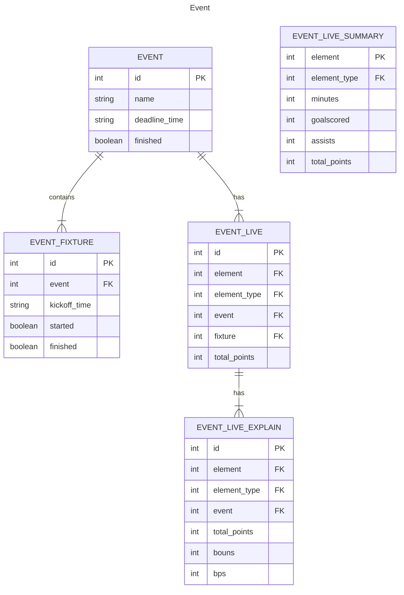
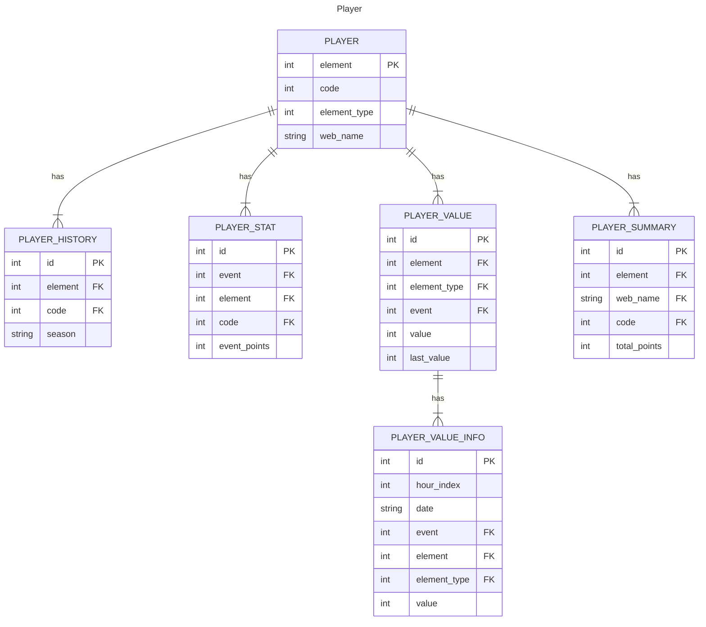
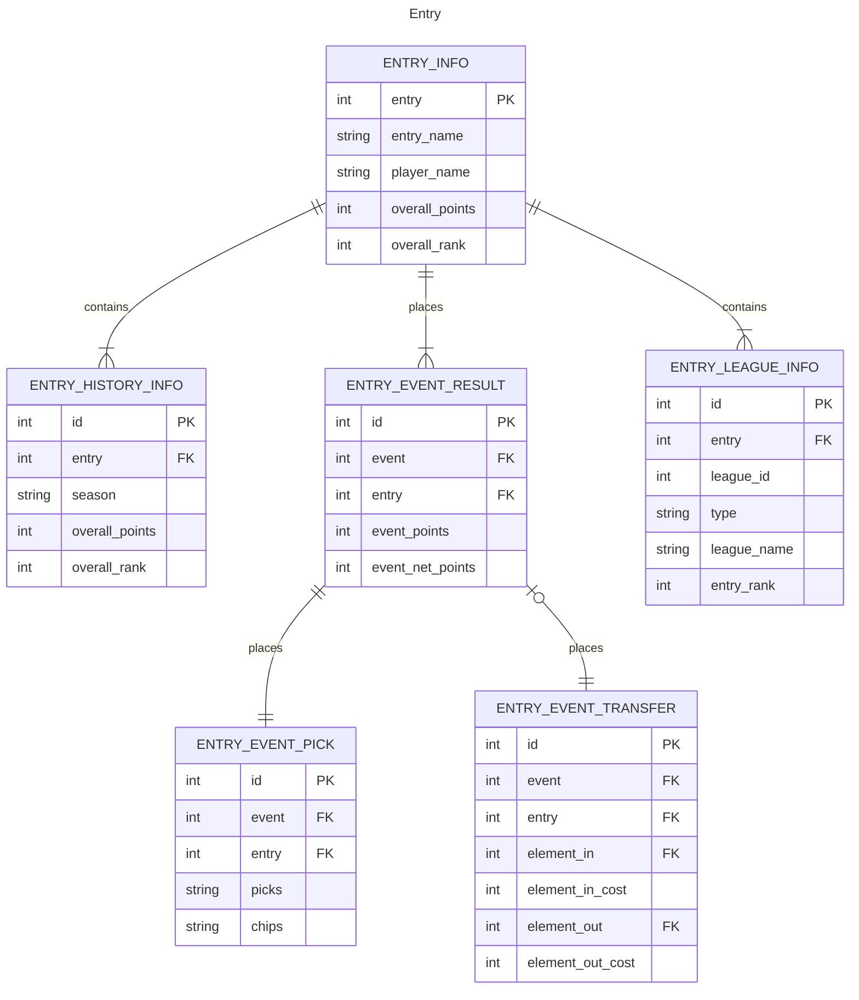
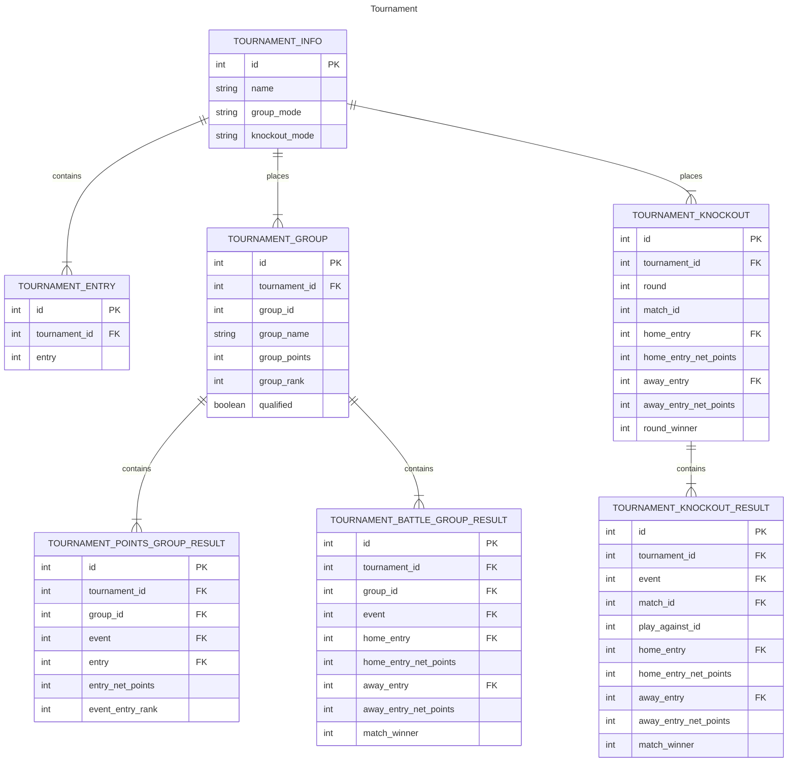

# Overall

FPL is the primary repository of the LetLetMe projects, a personal project designed for managing and analyzing Fantasy Premier League (FPL) data, providing tools and services to FPL players.

This project started as a combined frontend and backend initiative but evolved into multiple projects, each focusing on a specific aspect of the system. Initially, the frontend and backend were separated, and later, the backend was further divided into multiple projects, catering to services for clients, data processing, and notifications. The system architecture is depicted in the following diagram.

FPL utilises Spring Boot as the backend framework, with all services implemented as REST APIs. It operates efficiently within the Java ecosystem, offering ease of maintenance and extensibility.

# Tech Stack

## Backend

- **[Java 20](https://www.java.com/en/)** + **[Spring Boot 3](https://spring.io/projects/spring-boot)**

- **[MySQL](https://www.mysql.com/)** for data storage

- **[Redis](https://redis.io/)** for caching

- **[Maven](https://maven.apache.org/)** for build and dependency management

- **[Logback](https://github.com/qos-ch/logback)** for logging

- **[Jasypt](https://github.com/ulisesbocchio/jasypt-spring-boot)** for encryption and decryption of sensitive data

- **[Jenkins](https://www.jenkins.io/)** for CI/CD

- **[Thymeleaf](https://www.thymeleaf.org/)** for server-side template

## Frontend

- **[Layui](https://github.com/layui/layui)** for user interface

- **[Axios](https://axios-http.com/)** for HTTP Client for browser

- HTML5 + JavaScript + CSS3

# LetLetMe Universe Architecture

## Web Service Architecture

### Client Side
There are currently two clients for _LetLetMe_: one is the website, and the other is the WeChat mini-program client, maintained in separate projects: [letletme-web](https://github.com/tonglam/letletme-web) and [miniprogram-letletme](https://github.com/tonglam/miniprogram-letletme).

In the beginning, back in 2020, as it was intended to be a simple toy project, the website was designed as a server-side rendered web application using Thymeleaf as the template engine, implemented with basic HTML, CSS, and JavaScript. 
For UI components, I chose [Layui](https://github.com/layui/layui), fitting my background as a Java backend engineer, which allowed me to build the website quickly with less time spent on learning frontend stuff.

However, as the project grew, the website began to exhibit multiple limitations. 
It was not designed to be responsive, making it unfriendly to mobile users. 
Additionally, as a non-single-page application, the user experience was suboptimal. 
Considering that most of my users are in China, in May 2021, I decided to introduce the WeChat mini-program as the second client, offering a more user-friendly experience for Chinese users, especially on mobile devices (both iOS and Android). 
Afterward, I dedicated most of my time to frontend work on the mini-program client, and the website was not updated frequently.

I had plans to rebuild the website using a modern frontend framework like React or Vue but didn't find enough time to do so. 
Recently, in February 2024, I began using Next.js to rebuild the website in [letletme-web](https://github.com/tonglam/letletme-web), and the project is still in progress. 
The new version of the website will be based on a modern framework, mobile-friendly, and free from the WeChat ecosystem, which has become increasingly sickening for me day by day.
When the new website is ready, I will deprecate the old website in this project and focus on maintaining the new one.

## Service Side
The backend services are divided into four projects: FPL, Fpl-data, Fpl-audit, and Telegram_bot.

### [FPL](https://github.com/tonglam/fpl-public)
[FPL](https://github.com/tonglam/fpl-public) is the core service of _LetLetMe_ universe, providing services to clients. 
After the WeChat mini-program client was introduced, the FPL project focused on backend tasks.
All the REST APIs are implemented in this project. 
Additionally, it provides backend capabilities such as:

- Creating and managing customer tournaments in multiple modes
- Calculating live FPL Points and live FPL League Rankings
- Providing summaries and reports of each user's FPL team
- Offering summaries and reports of user tournament performance
- Providing FPL tools like _price change_, _player stat_, _team selection_, etc.

### [Fpl-data](https://github.com/tonglam/fpl-data-public)
[Fpl-data](https://github.com/tonglam/fpl-data-public) fetches data from the _Fantasy Premier League_ servers, cleans and transforms the data, and then stores it in **MySQL** and **Redis**.

### [Fpl-audit](https://github.com/tonglam/fpl-audit)
As one of the main purposes of _LetLetMe_ is providing FPL data to users, 
it is vital to ensure the data shown on the _LetLetMe_ frontend is exactly the same as users can view from the _FPL official website_.
[Fpl-audit](https://github.com/tonglam/fpl-audit) checks the data from FPL official APIs, as well as those stored in the database. 
When it finds any data mismatches, it updates the data in the database to correct it. 
Basically, it is a corrective mechanism to ensure the data is always correct and up-to-date.

### [Telegram_bot](https://github.com/tonglam/telegramBot-public)
This is the simplest service in the LetLetMe universe. 
It is a Telegram bot service that sends notifications to users.

# Modules

## REST API

## Services

## DB
**MySQL** serves as the relational database for this project, and the [MyBatis_Plus](https://github.com/baomidou/mybatis-plus) framework is selected to augment the utilisation of **MyBatis** within the project.
The Entity Relationship Diagram (ERD) is shown below to illustrate the relationship between tables designed in the database.

## Caching
This project serves as a provider for a lot of data querying through **REST APIs**, so the caching mechanism is crucial for performance.

For most of the data, I use a two-level caching mechanism, 
with the first level being the in-memory cache provided by **Spring Cache**, and the second level being **Redis**. 
When a query is made, the system first checks the in-memory cache, and if the data is not found, it checks the Redis cache; 
if all the caches are missed, the system queries the database and then stores the data in both the in-memory cache and Redis.

The mechanism protects the database from being overwhelmed by queries and provides a better user experience. 
It is a good practice in the **Java ecosystem** to use a **two-level caching** for frequently queried data.

## AOP and Logging
The usage of AOP in the project is to log the service behaviors without modifying the business logic.

To facilitate better maintenance, the logging in the project is designed to be flexible and user-friendly.
The project utilizes **Logback** as the logging framework and **Slf4j** as the logging facade.
The logback configuration file, *logback-spring.xml*, is located in the resources folder and is tailored for flexibility and ease of use.

Logs are separated into three files:
- *controller.log*: Time-based, rolled daily, used for monitoring the requests and responses of the REST APIs providing for the frontend.
- *api_controller.log*: Time-based, rolled daily, used for monitoring the requests and responses of the REST APIs providing for the WeChat mini-program.
- *interface.log*: Time-based, rolled daily, used for monitoring the requests and responses of the interfaces, specifically HTTP calls between this project and others.
- *fpl.log*: Time-based, rolled daily, used for monitoring the business logic of the project.

# Vital Services Details
